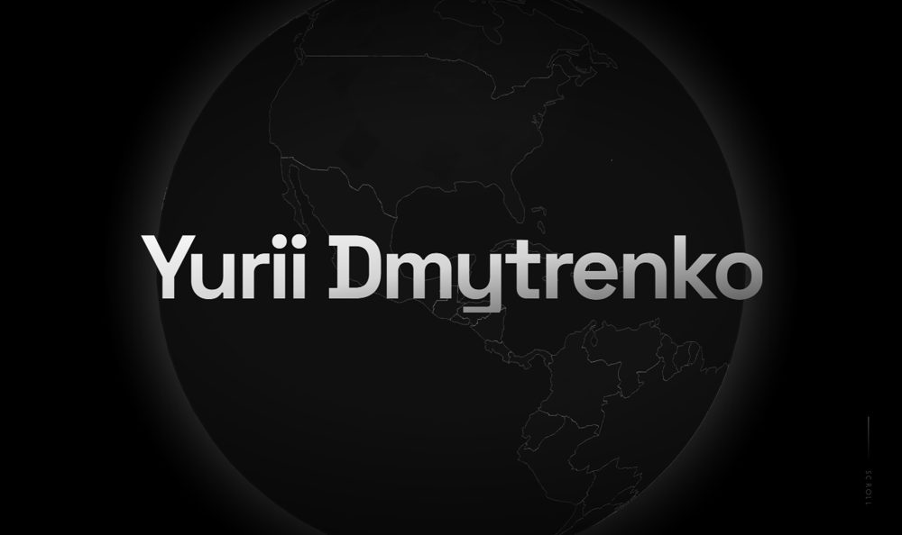

# Portfolio

<!-- badges -->
[](https://github.com/YuraItDeveloper14/Portfolio/actions/workflows/build.yml) [](LICENSE) [](https://github.com/YuraItDeveloper14/Portfolio/commits)

<!-- preview -->
<p align="center">
  
</p>

Personal site of Yurii Dmytrenko, full-stack developer from Ukraine.

**Live:** [yurii-dmytrenko.vercel.app](https://yurii-dmytrenko.vercel.app)

## What is in it

- **Hero** — a 3D globe pinned to the screen while you scroll. The name gives way to the role,
  then the globe turns and the camera flies down to Ukraine.
- **About me** — a four-step timeline: The Beginning, Front-End Focus, Full-Stack Transition,
  Crafting Experiences.
- **Services** — front-end development, back-end architecture, premium animations.
- **Skills**, and a **contact form** that sends the message through Web3Forms.

## Stack

Next.js 16 (App Router) · React 19 · TypeScript · Tailwind CSS 4 · GSAP ScrollTrigger for the
pinned hero · react-globe.gl on Three.js for the globe · Framer Motion for the section reveals.

## Running it

```bash
npm install
npm run dev
```

Then open http://localhost:3000. For the production build: `npm run build`, then `npm start`.

## Layout

```
src/app/layout.tsx         fonts and page metadata
src/app/page.tsx           the page, section by section
src/components/Hero.tsx    the globe and its scroll timeline
src/components/            the other sections and the footer
src/data/countries.json    country shapes the globe draws
tests/test_smoke.py        browser smoke test
```

## Tests

After `npm run build`, start the server with `npx next start -p 3100` and run
`SITE_URL=http://127.0.0.1:3100/ python -m pytest -q tests`: the page opens in Chromium,
the name shows and no script error is thrown, on load or while scrolling past the globe.
Needs `pip install pytest playwright` and `python -m playwright install chromium`.

## Licence

MIT — see [LICENSE](LICENSE).
